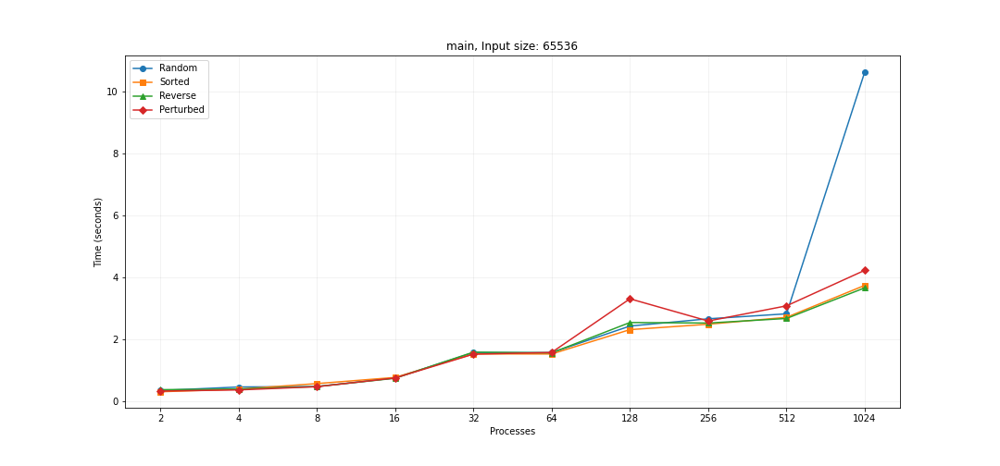
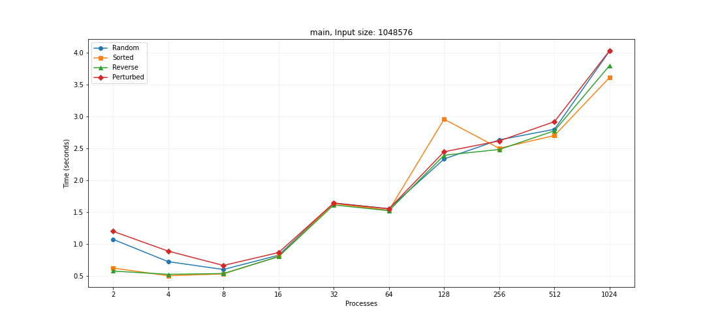
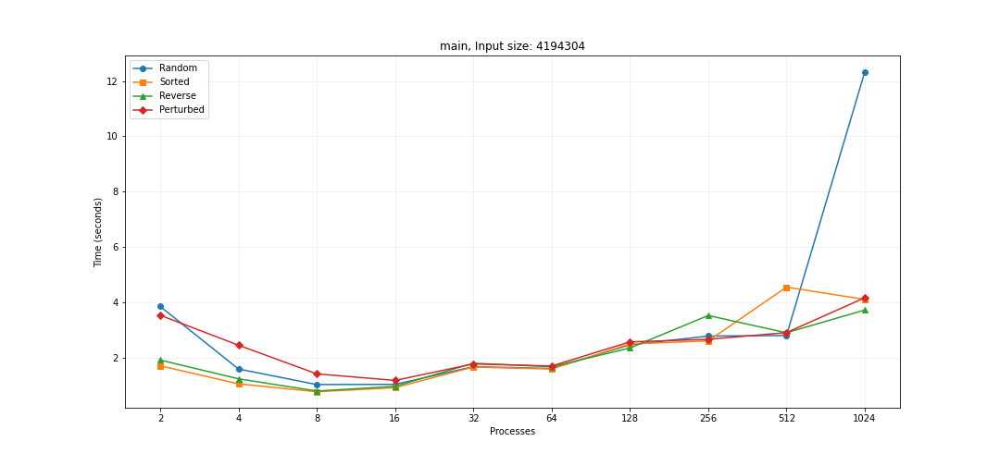
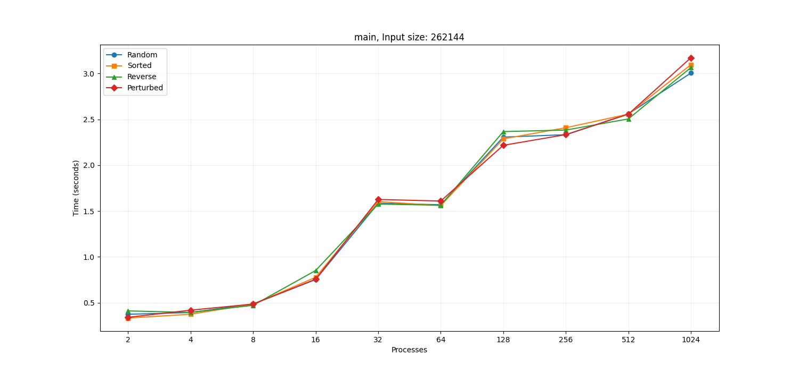
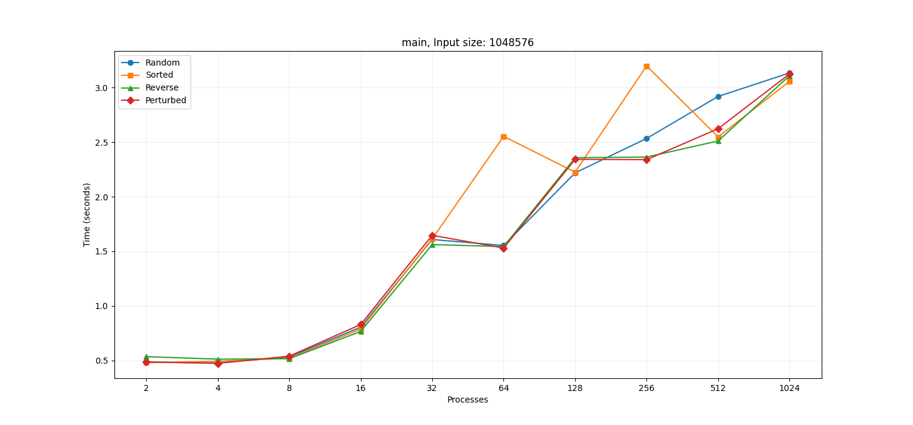
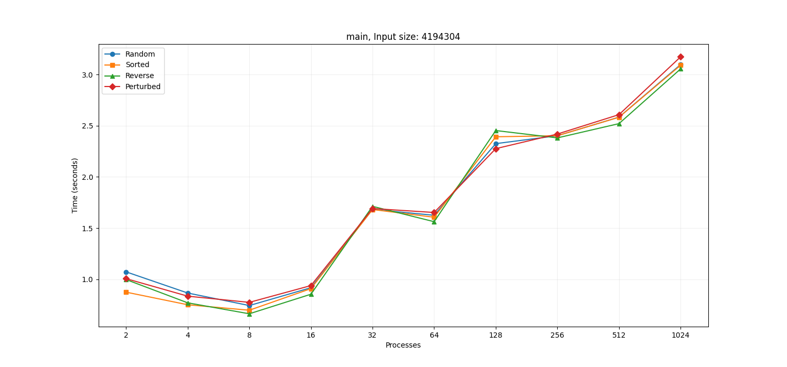
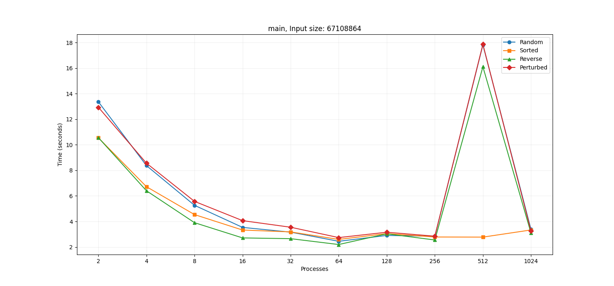

# CSCE 435 Group project

## 0. Group number: 1 

Our team will be using Discord to communicate with each other.

## 1. Group members:
1. Jack Vacek - Merge Sort
2. Christopher Vu - Bitonic Sort
3. Victor Pan - Sample Sort
4. Zak Borman - Radix Sort

## 2. Project topic: Parallel Sorting Algorithms

### 2a. Brief project description (what algorithms will you be comparing and on what architectures)

**Algorithms Descriptions:**
- Bitonic Sort: A parallel divide-and-conquer sorting algorithm that creates a bitonic sequence (a series of numbers that monotonically increase and then monotonically decrease) from the input data. To do this, the algorithm uses a network of comparators to perform compare-exchange operations to ensure that the sequence follows this. Then, the algorithm merges the two halves of the sequence to end with a sorted sequence. To implement this sorting algorithm, I will be using the MPI and Grace CPU architecture to parallelize the splitting and compare/swap operations.
- Sample Sort: A parallel sorting algorithm that works by distributing the data into approximately equal-sized buckets and then sorting each bucket. A random sample of elements is then selected from the given data to determine "pivots" or "splitters" that partitions the data into subsets. Each subset is then sorted independently and merged into a fully sorted output. To run this Sample Sort algorithm, the Grace cluster will be used along with the MPI library, which will serve as the framework for communication between processors/nodes and for the parallelization of the sorting process in general. 
- Merge Sort: A sorting algorithm that uses the divide-and-conquer strategy. This is done by splitting the array down into halves until there is one element left, thus sorting it by default. It then merges these sublists back in sorted order until the original list is sorted. This sorting algorithm is parallelized by splitting the original list down to the number of cores and then sorting those lists in parallel, merging the two halves by the "parent" of those processes and going all the way up back to the original list. I will be doing this using MPI to communicate between processes and HPRC Grace CPU architecture to parallelize the sorting of this algorithm.
- Radix Sort: A linear sorting algorithm that sorts elements by processing them digit by digit. Rather than comparing elements directly, Radix Sort distributes the elements into buckets based on each digit’s value. By repeatedly sorting the elements by their significant digits, from the least significant to the most significant, Radix Sort achieves the final sorted order. To implement this algorithm, I will be using the MPI library to facilitate communication between processes and the Grace CPU architecture to parallelize this.

**Source Code Descriptions:**
- Bitonic Sort: In this implentation of Bitionic Sort, MPI is initialized and the number of processes and rank of the current process is obtained. It also accepts two command line arguments: n, the total number of elements we're going to generate & sort, and input_type, which (Random, Sorted, ReverseSorted, or 1% perturbed). Based on this, each process independently creates a local array of size n/num_processes and initializes the array based on the input type. With this, each process has its own local data set, which forms the entire input if put together. Next, each process sorts its own localArray in ascending order to set up the merging procedure in bitonic sort. After that, we go into our nested loop, which goes through a series of log2(num_processes) stages and steps. In each step, the current process and it's partner are paired up to compare and exchange with each other using the XOR operator, which lets each process pair with a different partner in each step. After that, each process sends over its local array with its partner and vice versa. The two sorted arrays are merged together in a way that the sorted property remains and, depending on the direction of the sort, the current process's rank and its partner's rank, either the lower half or the upper half of the merged array is kept. After each stage, there is a barrier that waits for all processes to finish before proceeding to the next one. Finally, in the correctness check, each process checks to see if its local array is sorted and that the next rank is larger than the current one. 
- Sample Sort: In this implementation of Sample Sort, each process independently generates its own portion of the input data based on the specified type (random, sorted, reverse sorted, or 1% perturbed). Each processor has its own local data set where collectively, the entire input is formed. Since the data is already split between processors, the first step of Sample Sort is complete after generation. Next, each processor sorts its local data. After sorting, samples are chosen for each processor's local data. Oversampling is utilized in this algorithm for better scaling and to provide samples that better represent the data itself. Each processor selects *k * num_procs* evenly spaced samples from its sorted local data, where *k* is the oversampling factor and *num_procs* is the number of processors. The local samples are then gathered from all processors into a global sample array. The global sample array is then sorted, and *num_procs - 1* pivots are selected at evenly spaced intervals to divide the data range into num_procs buckets. After selecting the pivots from the samples, each processor partitions its sorted local data into these buckets based on the pivots. The buckets are then exchanged between the processors to ensure each processor gets the values with their respective bucket. Each processor now has the data that falls within its assigned range based off of the selected pivots. After the data exchange, each processor performs a final sort on its local dataset and the data as a whole is checked to ensure it is sorted across all processors.
- Merge Sort: In this implementation of Merge Sort, the user passes in through the command line arguments the number of processes, size of the array, and what type of input data (random, sorted, reverse sorted, or 1% perturbed). After reading these inputs, the choose_array_type method is called in the master process to generate the data to be sorted. Once this data is generated and populated into the array, MPI_Scatter is called to break the array into equal pieces for each of the processes to sort individually. With each process having equal parts, they will all call a sequential version of merge sort. This is due to having more data than processes, so each process receives a smaller version of the overall problem to parallelize the computation. Each process will individually sort their local array and then their results will be gathered into the overall array, overwriting the data previously contianed in that array. MPI_Gather is called to gather the results from the individual processes to store them into the overall array. Then in the master process, the merge function is called to sort the overall array correctly by choosing the correct indices. Once the overall array is merged, the correctness_checker function is called to determine whether or not the overall array was sorted. It will print out that the program is correct if it was sorted correctly.
- Radix Sort: This parallel radix sort algorithm leverages MPI to distribute the sorting workload across multiple processors, enabling efficient handling of large datasets. It takes two input arguments: the input size (e.g., 2^16, 2^18, etc.) and the input type (Sorted, ReverseSorted, Random, or 1% Perturbed). The input array is generated by the root process and distributed to all processors using MPI_Scatter. Each processor performs a local radix sort on its segment of the array, using counting sort to sort numbers digit by digit. Once sorted locally, the segments are gathered back to the root process with MPI_Gather. The root process merges the sorted segments into a single array and performs a correctness check by verifying that the final array is in non-decreasing order. If any element is found out of place, the program reports an error; otherwise, it confirms that the sorting was successful.

### 2b. Pseudocode for each parallel algorithm
- For MPI programs, include MPI calls you will use to coordinate between processes

**Bitonic Sort**
```
// Initialize MPI
MPI_Init()

// Get number of processes and current process rank
num_processes = MPI_Comm_size(MPI_COMM_WORLD)
rank = MPI_Comm_rank(MPI_COMM_WORLD)

// Get input array and ensure all processes have the size of the input array
If rank == 0:
	Read input array as input_array
	n = size of input_array

// Broadcast n to non-master processes
MPI_Bcast

// Create a new local array based on the number of processors
localSize = num_processors / n

// Evenly distribute chunks of A to each process using MPI_Scatter and localSize
MPI_Scatter

localArray = array of size localSize holding the contents after MPI_Scatter

sort localArray in ascending order if rank / localSize is even otherwise sort descending

num_stages = log_2(P)

for each stage from 1 to num_stages:
	for each step from stage to 0:
		// Getting partner rank to determine what process to compare and exchange with
		partner = rank ^ step
		ascending = true if rank / localSize is even
 
        	if (rank < partner) and ascending:
			// Use MPI_SendRecv to exchange array data with partner
			MPI_SendRecv

			Compare and exchange with partner to ensure ascending order

        	else if (rank > partner) and not ascending:
			// Use MPI_SendRecv to exchange array data with partner
			MPI_SendRecv

			Compare and exchange with partner to ensure descending order

    	// Synchronize all processes after each step
    	MPI_Barrier()

// Gather the fully sorted chunks at the root process
if rank == 0:
	// Gather sorted chunks from all processes into A
	MPI_Gather

	// Print out A
	for element in A:
		print(element)
else:
	// Gather local sorted array
	MPI_Gather

// Finalize MPI
MPI_Finalize
```

**Sample Sort**
```
// Initialize MPI
MPI_Init

// Get number of processes and current process rank
num_processes = MPI_Comm_size(MPI_COMM_WORLD)
rank = MPI_Comm_rank(MPI_COMM_WORLD)

// Get input array and ensure all processes have the size of the input array
If rank == 0:
	Read input array as input_array
	n = size of input_array

// Broadcast n to non-master processes
MPI_Bcast

// Split input array into buckets and send them to each process depending on calculated bucket sizes and displacements
Calculate bucket sizes of each process and displacements

// Scatter input_array to each process
MPI_Scatterv

// Sort the buckets in each process locally
Sort local_bucket

// Calculate s and select s local samples from each process
s = number of samples
Select s evenly spaced elements from each processes' local_bucket as samples

// Gather all local samples at the master process
MPI_Gather

// Sort samples then select pivots
If rank == 0:
	Sort gathered samples
	Select num_processes - 1 pivots from gathered samples

// Send pivots to non-master processes
MPI_Bcast

// Reorganize buckets based on pivots
Initialize num_processes empty buckets
For each element in local_bucket:
    Determine the appropriate bucket based on pivots
    Place element into its corresponding bucket

// Get number of elements to send to each process in order for each process to know the number of elements they are receiving from each process
Prepare new bucket sizes
MPI_Alltoall

// Prepare and send new buckets based on pivots to its corresponding process
Calculate send and receive displacements
Flatten new buckets based on pivots in a single array
MPI_Alltoallv

// Sort received data from pivots of each processes' bucket
Sort received_data

// Gather sorted buckets in the master process combine them into a fully sorted array
MPI_Gatherv

// Finalize MPI
MPI_Finalize
```
**Merge Sort**
```
// import mpi, caliper, adiak, etc.
// define my master and worker
// main function
main:
// store the size of the array
sizeOfArray = input from user

// create various variables for number of tasks, workers, source, dest, etc. (and buffers)
numtasks, numworkers, source, dest, timing variables

//make the unsorted array of desired size
for loop to make the overall array

// Initialize MPI
MPI_Init
MPI_Comm_rank
MPI_Comm_size

// how many elements each process is working with
amount = elements / processes

// evenly split the arrays along available processes with MPI_Scatter
MPI_Scatter

// make each process do mergesort locally
localMergeSort

//get all the information from the number of processes into overall list
MPI_Gather

//if the master program, then we will merge all the elements into overall, final array
if master:
	localMergeSort

//make sure everything is synced
MPI_Barrier

// Finalize MPI
MPI_Finalize

// Local merge sort function is the sequential version
```
**Radix Sort**
```
Initialize MPI
Get total number of processes (P) and current process rank (rank)

if rank == 0:
    Read input array A
    Broadcast the size of A to all processes
else:
    Receive the size of A

Distribute chunks of A to each process (scatter)
Each process now has a local chunk A_local

for each digit position (starting from least significant to most significant):
    
    // Step 1: Local counting sort by the current digit
    Initialize local_count array to count occurrences of each digit (0-9)
    for each element in A_local:
        Extract the current digit
        Increment local_count[current_digit]

    // Step 2: Gather the counts from all processes to the root
    if rank == 0:
        global_count = Gather local_count from all processes
    else:
        Send local_count to root process

    if rank == 0:
        // Step 3: Compute global offsets based on global_count
        Calculate the start index for each process based on global_count
        Send offsets to all processes

    // Step 4: Each process rearranges its local data based on the offsets
    Receive offsets from root
    Initialize local_sorted array
    for each element in A_local:
        Extract the current digit
        Place element in the correct position in local_sorted using offsets

    // Synchronize all processes
    Barrier()

// Step 5: Gather sorted chunks at the root process
if rank == 0:
    Gather sorted chunks from all processes into A
else:
    Send local_sorted to root process

if rank == 0:
    Print the fully sorted array A

Finalize MPI
```

### 2c. Evaluation plan - what and how will you measure and compare
- Input sizes, input types, and number of processors used in MPI
	- Input Sizes:
		- 2^16, 2^18, 2^20, 2^22, 2^24, 2^26, 2^28
	- Input Types:
		- Sorted, Random, Reverse sorted, 1% perturbed
	- Number of Processors:
		- 2, 4, 8, 16, 32, 64, 128, 256, 512, 1024
- Strong scaling (same problem size, increase number of processors/nodes)
	- For strong scaling, we will choose one of the input sizes as the fixed problem size and increase the number of processors according to the range of number of processors provided above. This will be performed for each input size and input type. We will evaluate the effect of strong scaling by comparing runtimes to observe how our algorithms perform with the use of additional processors when maintaining a fixed problem size.
- Weak scaling (increase problem size, increase number of processors)
	- For weak scaling, we will increase the problem size as we increase the number of processors following the given input sizes and processor counts. This will be performed for each input type. By comparing runtimes, we will assess the effect weak scaling has on the performance of each of our algorithms when both the problem size and number of processors grows.

### 3a. Caliper instrumentation
Please use the caliper build `/scratch/group/csce435-f24/Caliper/caliper/share/cmake/caliper` 
(same as lab2 build.sh) to collect caliper files for each experiment you run.

Your Caliper annotations should result in the following calltree
(use `Thicket.tree()` to see the calltree):
```
main
|_ data_init_X      # X = runtime OR io
|_ comm
|    |_ comm_small
|    |_ comm_large
|_ comp
|    |_ comp_small
|    |_ comp_large
|_ correctness_check
```

Required region annotations:
- `main` - top-level main function.
    - `data_init_X` - the function where input data is generated or read in from file. Use *data_init_runtime* if you are generating the data during the program, and *data_init_io* if you are reading the data from a file.
    - `correctness_check` - function for checking the correctness of the algorithm output (e.g., checking if the resulting data is sorted).
    - `comm` - All communication-related functions in your algorithm should be nested under the `comm` region.
      - Inside the `comm` region, you should create regions to indicate how much data you are communicating (i.e., `comm_small` if you are sending or broadcasting a few values, `comm_large` if you are sending all of your local values).
      - Notice that auxillary functions like MPI_init are not under here.
    - `comp` - All computation functions within your algorithm should be nested under the `comp` region.
      - Inside the `comp` region, you should create regions to indicate how much data you are computing on (i.e., `comp_small` if you are sorting a few values like the splitters, `comp_large` if you are sorting values in the array).
      - Notice that auxillary functions like data_init are not under here.
    - `MPI_X` - You will also see MPI regions in the calltree if using the appropriate MPI profiling configuration (see **Builds/**). Examples shown below.

All functions will be called from `main` and most will be grouped under either `comm` or `comp` regions, representing communication and computation, respectively. You should be timing as many significant functions in your code as possible. **Do not** time print statements or other insignificant operations that may skew the performance measurements.

### **Nesting Code Regions Example** - all computation code regions should be nested in the "comp" parent code region as following:
```
CALI_MARK_BEGIN("comp");
CALI_MARK_BEGIN("comp_small");
sort_pivots(pivot_arr);
CALI_MARK_END("comp_small");
CALI_MARK_END("comp");

# Other non-computation code
...

CALI_MARK_BEGIN("comp");
CALI_MARK_BEGIN("comp_large");
sort_values(arr);
CALI_MARK_END("comp_large");
CALI_MARK_END("comp");
```

### **Calltree Example**:
```
# MPI Mergesort
4.695 main
├─ 0.001 MPI_Comm_dup
├─ 0.000 MPI_Finalize
├─ 0.000 MPI_Finalized
├─ 0.000 MPI_Init
├─ 0.000 MPI_Initialized
├─ 2.599 comm
│  ├─ 2.572 MPI_Barrier
│  └─ 0.027 comm_large
│     ├─ 0.011 MPI_Gather
│     └─ 0.016 MPI_Scatter
├─ 0.910 comp
│  └─ 0.909 comp_large
├─ 0.201 data_init_runtime
└─ 0.440 correctness_check
```

**Bitonic Sort Example Calltree**
```
1.68131 main
├─ 0.00004 MPI_Init
├─ 0.00286 data_init_runtime
├─ 0.06696 comp
│  ├─ 0.06663 comp_large
│  └─ 0.00008 comp_small
├─ 0.02028 comm
│  ├─ 0.00941 comm_large
│  │  └─ 0.00926 MPI_Sendrecv
│  └─ 0.01073 MPI_Barrier
├─ 0.00065 correctness_check
│  ├─ 0.00013 MPI_Send
│  ├─ 0.00003 MPI_Recv
│  └─ 0.00009 MPI_Allreduce
├─ 0.00000 MPI_Finalize
├─ 0.00001 MPI_Initialized
├─ 0.00001 MPI_Finalized
└─ 0.00083 MPI_Comm_dup
```

**Sample Sort Example Calltree**
```
1.686 main
├─ 0.000 MPI_Init
├─ 0.010 data_init_runtime
├─ 0.108 comp
│  ├─ 0.107 comp_large
│  └─ 0.001 comp_small
├─ 0.016 comm
│  ├─ 0.012 comm_small
│  │  ├─ 0.011 MPI_Allgather
│  │  └─ 0.001 MPI_Alltoall
│  └─ 0.004 comm_large
│     └─ 0.004 MPI_Alltoallv
├─ 0.021 correctness_check
│  ├─ 0.000 MPI_Send
│  ├─ 0.020 MPI_Recv
│  └─ 0.000 MPI_Allreduce
├─ 0.000 MPI_Finalize
├─ 0.000 MPI_Initialized
├─ 0.000 MPI_Finalized
└─ 0.000 MPI_Comm_dup
```

**Merge Sort Example Calltree**
```
2.27236 main
├─ 0.51182 MPI_Comm_dup
├─ 0.00001 MPI_Finalize
├─ 0.00001 MPI_Finalized
├─ 0.00004 MPI_Init
├─ 0.00001 MPI_Initialized
├─ 0.09589 comm
│  └─ 0.09586 comm_large
│     ├─ 0.00047 MPI_Gather
│     └─ 0.09535 MPI_Scatter
├─ 0.05614 comp
│  ├─ 0.50816 comp_large
│  └─ 0.04023 comp_small
├─ 0.01107 correctness_check
└─ 0.09147 data_init_runtime
```

**Radix Sort Example Calltree**
```
0.50797 main
├─ 0.02925 MPI_Comm_dup
├─ 0.00001 MPI_Finalize
├─ 0.00001 MPI_Finalized
├─ 0.00004 MPI_Init
├─ 0.00001 MPI_Initialized
├─ 0.00143 comm
│  └─ 0.00142 comm_large
│     └─ 0.00139 MPI_Gather
├─ 0.12496 comp
│  └─ 0.12492 comp_large
├─ 0.00783 correctness_check
└─ 0.03707 data_init_runtime
```

### 3b. Collect Metadata

Have the following code in your programs to collect metadata:
```
adiak::init(NULL);
adiak::launchdate();    // launch date of the job
adiak::libraries();     // Libraries used
adiak::cmdline();       // Command line used to launch the job
adiak::clustername();   // Name of the cluster
adiak::value("algorithm", algorithm); // The name of the algorithm you are using (e.g., "merge", "bitonic")
adiak::value("programming_model", programming_model); // e.g. "mpi"
adiak::value("data_type", data_type); // The datatype of input elements (e.g., double, int, float)
adiak::value("size_of_data_type", size_of_data_type); // sizeof(datatype) of input elements in bytes (e.g., 1, 2, 4)
adiak::value("input_size", input_size); // The number of elements in input dataset (1000)
adiak::value("input_type", input_type); // For sorting, this would be choices: ("Sorted", "ReverseSorted", "Random", "1_perc_perturbed")
adiak::value("num_procs", num_procs); // The number of processors (MPI ranks)
adiak::value("scalability", scalability); // The scalability of your algorithm. choices: ("strong", "weak")
adiak::value("group_num", group_number); // The number of your group (integer, e.g., 1, 10)
adiak::value("implementation_source", implementation_source); // Where you got the source code of your algorithm. choices: ("online", "ai", "handwritten").
```

They will show up in the `Thicket.metadata` if the caliper file is read into Thicket.

**Bitonic Sort Example Metadata**
```
launchdate: 1729089590
libraries: /scratch/group/csce435-f24/Caliper/caliper/lib64/libcaliper.so.2 + more...
cmdline: ['./bitonicsort', '4194304', 'Random']
cluster: c
algorithm: bitonic
programming_model: mpi
data_type: int
size_of_data_type: 4
input_size: 4194304
input_type: Random
num_procs: 32
scalability: strong
group_num: 1
implementation_source: handwritten
```

**Sample Sort Example Metadata**
```
launchdate: 1729125502
libraries: /scratch/group/csce435-f24/Caliper/caliper/lib64/libcaliper.so.2 + more...
cmdline: ['./samplesort', '4194304', 'Random']
cluster: c
algorithm: sample
programming_model: mpi
data_type: int
size_of_data_type: 4
input_size: 4194304
input_type: Random
num_procs: 32
scalability: strong
group_num: 1
implementation_source: handwritten
```

**Merge Sort Example Metadata**
```
launchdate: 1729128347
libraries: /scratch/group/csce435-f24/Caliper/caliper/lib64/libcaliper.so.2 + more...
cmdline: [./mergesort, 4194304, Random]	
cluster: c
algorithm: merge
programming_model: mpi
data_type: int
size_of_data_type: 4
input_size: 4194304
input_type: Random
num_procs: 32
scalability: strong
group_num: 1	
implementation_source: online/ai
```

**Radix Sort Example Metadata**
```
launchdate: 1729641751
libraries: /scratch/group/csce435-f24/Caliper/caliper/lib64/libcaliper.so.2 + more...
cmdline: ['./radixsort', '1048576', 'Random']
cluster: c
algorithm: radix
programming_model: mpi
data_type: int
size_of_data_type: 4
input_size: 1048576
input_type: Random
num_procs: 2
scalability: weak
group_num: 1
implementation_source: handwritten
```

### **See the `Builds/` directory to find the correct Caliper configurations to get the performance metrics.** They will show up in the `Thicket.dataframe` when the Caliper file is read into Thicket.
## 4. Performance evaluation

Include detailed analysis of computation performance, communication performance. 
Include figures and explanation of your analysis.

### 4a. Vary the following parameters
For input_size's:
- 2^16, 2^18, 2^20, 2^22, 2^24, 2^26, 2^28

For input_type's:
- Sorted, Random, Reverse sorted, 1%perturbed

MPI: num_procs:
- 2, 4, 8, 16, 32, 64, 128, 256, 512, 1024

This should result in 4x7x10=280 Caliper files for your MPI experiments.

### 4b. Hints for performance analysis

To automate running a set of experiments, parameterize your program.

- input_type: "Sorted" could generate a sorted input to pass into your algorithms
- algorithm: You can have a switch statement that calls the different algorithms and sets the Adiak variables accordingly
- num_procs: How many MPI ranks you are using

When your program works with these parameters, you can write a shell script 
that will run a for loop over the parameters above (e.g., on 64 processors, 
perform runs that invoke algorithm2 for Sorted, ReverseSorted, and Random data).  

### 4c. You should measure the following performance metrics
- `Time`
    - Min time/rank
    - Max time/rank
    - Avg time/rank
    - Total time
    - Variance time/rank

**Bitonic Sort Main Graphs**


 

**Analysis**


**Sample Sort Main Graphs**






 

<<<<<<< HEAD
**Analysis:**
- For these graphs, we can see that the trends change as the input size increases. This is because as the input size increases, the communication overhead begins to go away. For the first three graphs, we see that the times it take for communication overtakes the computation time. Since there are more processes to communicate between, the main time would increase as the number of processes increases. In the fourth graph, you can see that the communcation times and computation times begin to even out where computation times begin to matter more. This is noticeable throughout Min, Max, and Avg times per rank. The trend becomes something more linear and constant. For the final three graphs, we can see that computation completely overtakes communication times and the trend changes. We see that the time it takes to compute the data decreases as the number of processes increases. This is because the data is split up more and more, so the computation time decreases. The average time per rank gives a better look at these trends, but minimum and maximum times follows around the same trend with some outliers.
- For total time, the trends are mostly linearly increasing because there are more processes. More processes means for times to add for each process, so the total time increases.
- For variance time per rank, the trends are overall consistent except for some spikes for some jobs. This is normal since the sorting times should generally be consistent, but there are some outliers that can cause the variance to increase.
=======
**Radix Sort Main Graphs**






 
>>>>>>> 0010d104c40cc41cb0bb90cbd36658990c0a75d1

## 5. Presentation
Plots for the presentation should be as follows:
- For each implementation:
    - For each of comp_large, comm, and main:
        - Strong scaling plots for each input_size with lines for input_type (7 plots - 4 lines each)
        - Strong scaling speedup plot for each input_type (4 plots)
        - Weak scaling plots for each input_type (4 plots)

Analyze these plots and choose a subset to present and explain in your presentation.

## 6. Final Report
Submit a zip named `TeamX.zip` where `X` is your team number. The zip should contain the following files:
- Algorithms: Directory of source code of your algorithms.
- Data: All `.cali` files used to generate the plots seperated by algorithm/implementation.
- Jupyter notebook: The Jupyter notebook(s) used to generate the plots for the report.
- Report.md
